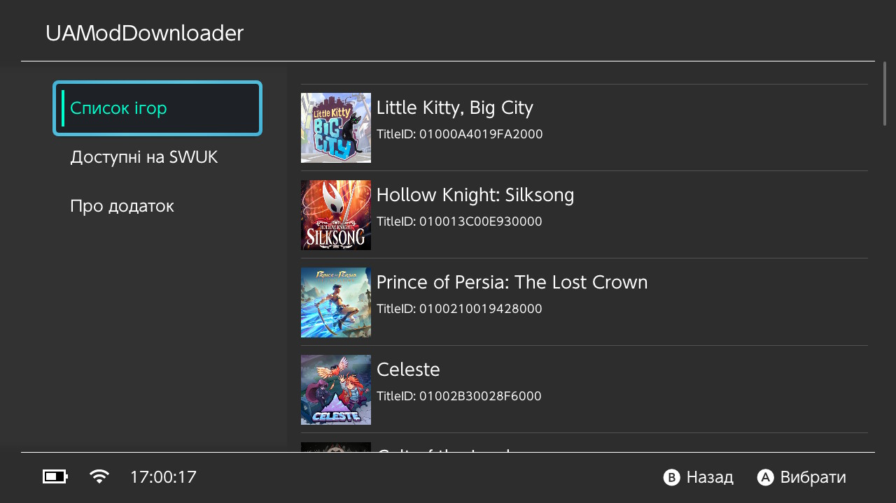
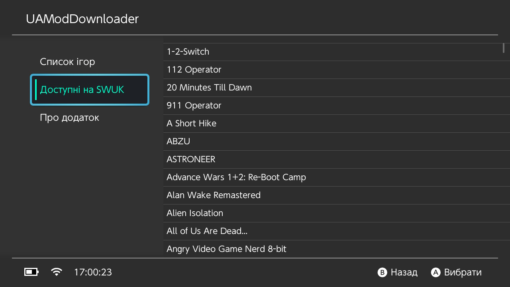
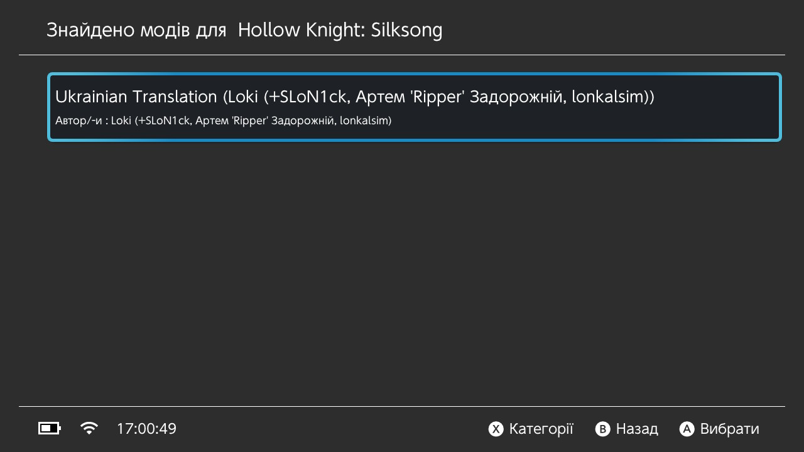
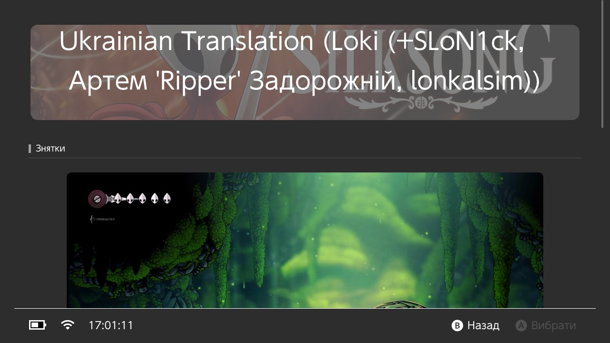
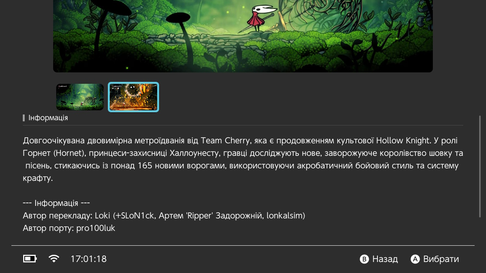
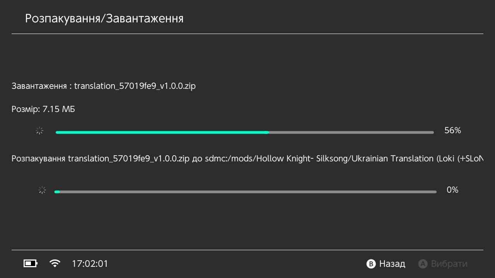

# 🎮 UAModDownloader

<div align="center">
  <p><strong>�🇦 Українська | 🇬🇧 English</strong></p>
</div>

---

## 🇺🇦 Українська

<div align="center">
    <p><strong>Nintendo Switch додаток, для завантаження і встановлення українізаторів з swuk.com.ua</strong></p>
</div>

<p align="center">
    <a rel="LICENSE" href="https://github.com/pro100luk/UAModDownloader/blob/master/LICENSE">
        
    </a>
    <a rel="VERSION" href="https://github.com/pro100luk/UAModDownloader">
        
    </a>
    <a rel="BUILD" href="https://github.com/pro100luk/UAModDownloader/actions">
        
    </a>
</p>

### ✨ Можливості

- 📥 **Завантажуйте українізатори** з swuk.com.ua безпосередньо з вашого Nintendo Switch
- 🎮 **Встановлюйте українізатори** прямо з Nintendo Switch за допомогою [UAModDownloader](https://github.com/pro100luk/UAModDownloader)
- 🌐 **Зручний інтерфейс** для легкої навігації
- 🚀 **Швидке та надійне** управління українізаторами

### 📥 Інсталяція

1. Завантажте найновіший файл `UAModDownloader.nro` зі [сторінки релізів](https://github.com/pro100luk/UAModDownloader/releases)
2. Помістіть `UAModDownloader.nro` у директорію `switch` на вашій SD картці
3. Безпечно вийміть SD картку та вставте її назад у Switch

### 🚀 Запуск

1. Затисніть та утримуйте кнопку **R** на контролері Switch
2. Виберіть будь-яку гру
3. Натисніть **A**
4. У меню homebrew виберіть і запустіть **UAModDownloader**

### 📸 Знімки екрану



<details>
  <summary><b>📷 Більше знімків</b></summary>







</details>

### 🔨 Як зібрати

#### Вимоги

- [devkitPro](https://devkitpro.org/wiki/Getting_Started)
- [Xmake](https://xmake.io/#/)

#### Кроки складання

```bash
(sudo) pacman -S switch-curl switch-zlib switch-glfw switch-mesa switch-glm switch-libarchive  
git clone --recursive https://github.com/pro100luk/UAModDownloader/
cd UAModDownloader
xmake f --yes -p cross -m release -a aarch64 --toolchain=devkita64
xmake
```

### 🤝 Допомога в розвитку

Знайшли баг або у вас є пропозиція? Ми будемо вдячні вашій допомозі!

- 🐛 **Повідомити про помилку**: Відкрийте issue з описом проблеми
- 💡 **Пропозиція функції**: Відкрийте issue з вашою пропозицією
- 🔧 **Pull Request**: Надішліть PR, якщо у вас є виправлення чи поліпшення

---

## 🇬🇧 English

<div align="center">
    <p><strong>A Nintendo Switch homebrew that downloads and installs Ukrainian mods from swuk.com.ua</strong></p>
</div>

<p align="center">
    <a rel="LICENSE" href="https://github.com/pro100luk/UAModDownloader/blob/master/LICENSE">
        
    </a>
    <a rel="VERSION" href="https://github.com/pro100luk/UAModDownloader">
        
    </a>
    <a rel="BUILD" href="https://github.com/pro100luk/UAModDownloader/actions">
        
    </a>
</p>

### ✨ Features

- 📥 **Download mods** from swuk.com.ua directly from your Nintendo Switch
- 🎮 **Install mods** directly from your Nintendo Switch with [UAModDownloader](https://github.com/pro100luk/UAModDownloader)
- 🌐 **User-friendly interface** for easy navigation
- 🚀 **Fast and reliable** mod management

### 📥 Installation

1. Download the latest `UAModDownloader.nro` from the [releases page](https://github.com/pro100luk/UAModDownloader/releases)
2. Place `UAModDownloader.nro` in the `switch` directory on your SD card
3. Safely eject your SD card and insert it back into your Switch

### 🚀 Launch

1. Press and hold **R** on your Switch controller
2. Select any game
3. Press **A**
4. In the homebrew menu, select and launch **UAModDownloader**

### 📸 Screenshots


<details>
  <summary><b>📷 More Screenshots</b></summary>


</details>

### 🔨 How to build

#### Requirements

- [devkitPro](https://devkitpro.org/wiki/Getting_Started)
- [Xmake](https://xmake.io/#/)

#### Build Steps

```bash
(sudo) pacman -S switch-curl switch-zlib switch-glfw switch-mesa switch-glm switch-libarchive  
git clone --recursive https://github.com/pro100luk/UAModDownloader/
cd UAModDownloader
xmake f --yes -p cross -m release -a aarch64 --toolchain=devkita64
xmake
```

### 🤝 Contributing

Found a bug or have a suggestion? We'd love your help!

- 🐛 **Bug Report**: Open an issue describing the problem
- 💡 **Feature Request**: Open an issue with your suggestion
- 🔧 **Pull Request**: Submit a PR if you have a fix or improvement

---

## 👏 Credits / Подяки

### **Data & Services / Дані та послуги:**
- Thanks to [swuk.com.ua](https://swuk.com.ua/) for their API and mod hosting
- Дякуємо [swuk.com.ua](https://swuk.com.ua/) за їх API та хостинг модів

### **Source & Inspiration / Джерело та натхнення:**
- Thanks to [PoloNX](https://github.com/PoloNX) for [SimpleModDownloader](https://github.com/PoloNX/SimpleModDownloader) which was used as source and inspiration for this project
- Дякуємо [PoloNX](https://github.com/PoloNX) за [SimpleModDownloader](https://github.com/PoloNX/SimpleModDownloader), який був використаний як джерело та натхнення для цього проекту


